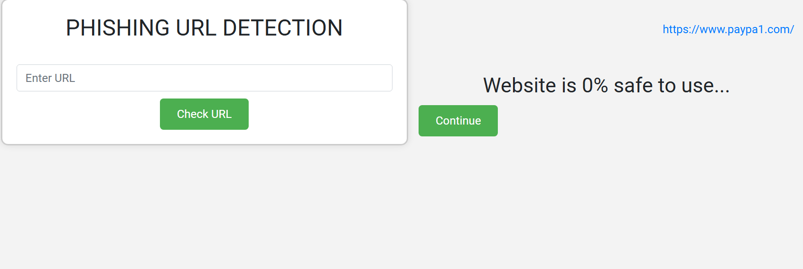

# Phishing URL Detection

This project is a web application designed to detect phishing URLs using machine learning.


<br>
## Features

- User Input: Allows users to input a URL for analysis.
- Feature Extraction: Extracts relevant features from the URL.
- Prediction: Provides a prediction on whether the URL is safe or potentially phishing.

## Setup

```bash
git clone https://github.com/premgodara-oss/phising_url_detection.git
cd phising_url_detection
pip install -r requirements.txt
python app.py
