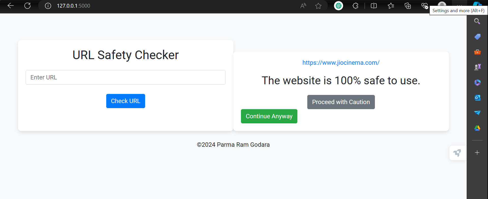

# URL Safety Checker

## Overview
The URL Safety Checker is a tool designed to assess the safety of URLs by analyzing them against various threat databases and heuristic checks. This project aims to help users identify potentially malicious or harmful websites.


## Features
- Checks URLs against multiple threat databases
- Analyzes URLs for phishing threats.
- Provides a safety score for each URL
- Offers a simple and intuitive user interface.
- Allows users to input a URL for analysis

## Installation
To install and set up the URL Safety Checker, follow these steps:

1. Clone the repository:
   ```bash
   git clone https://github.com/premgodara-oss/URL-Safety-Checker.git
2. Navigate to the project directory:
   ```bash
   cd URL-Safety-Checker
3. Install the required dependencies:
   ```bash
   pip install -r requirements.txt

## Usage
To run the URL Safety Checker, execute the following command:
```bash
python app.py


Contributions are welcome! 


 
